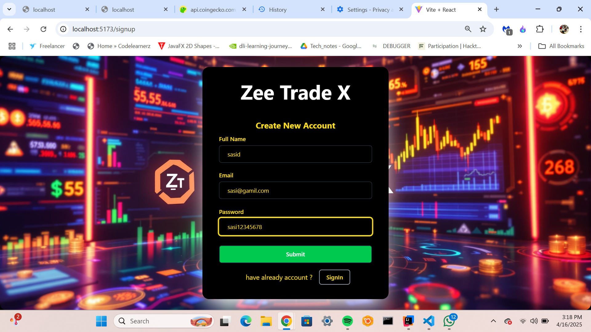
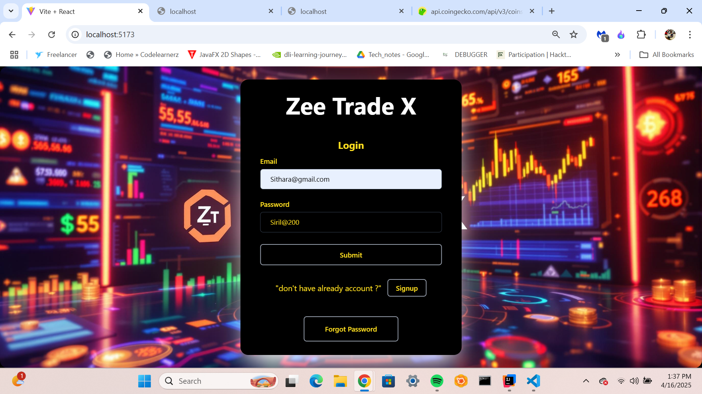
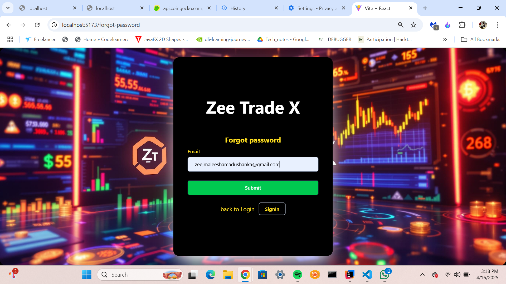
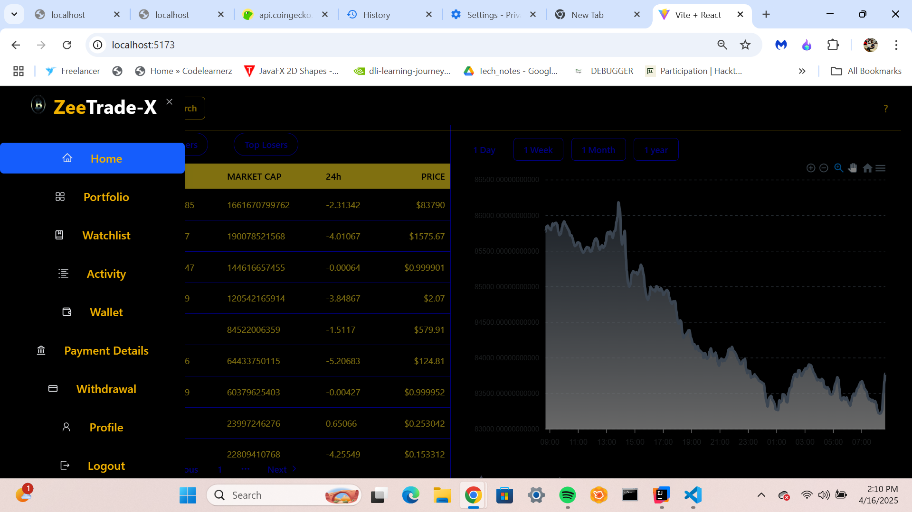
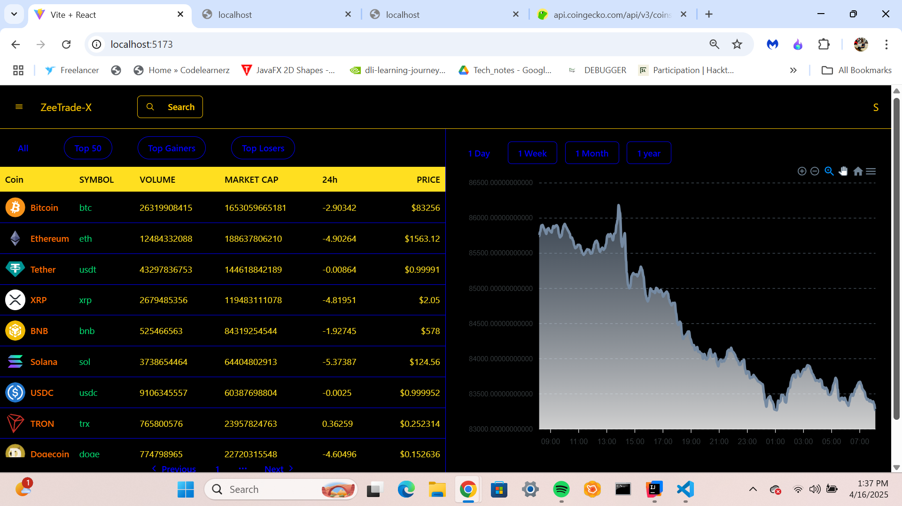
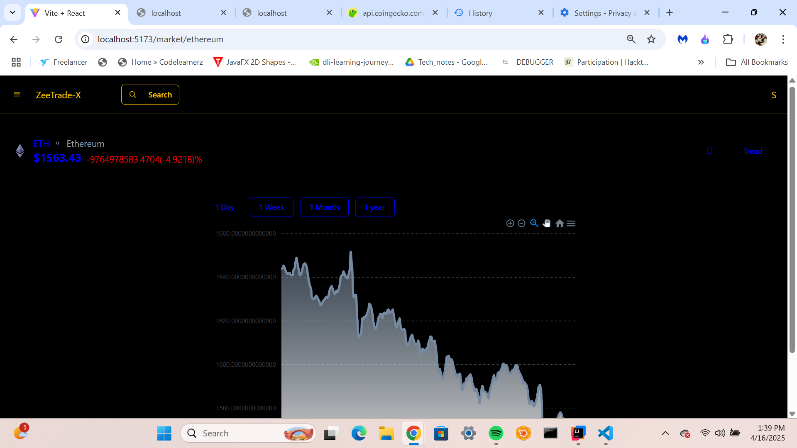
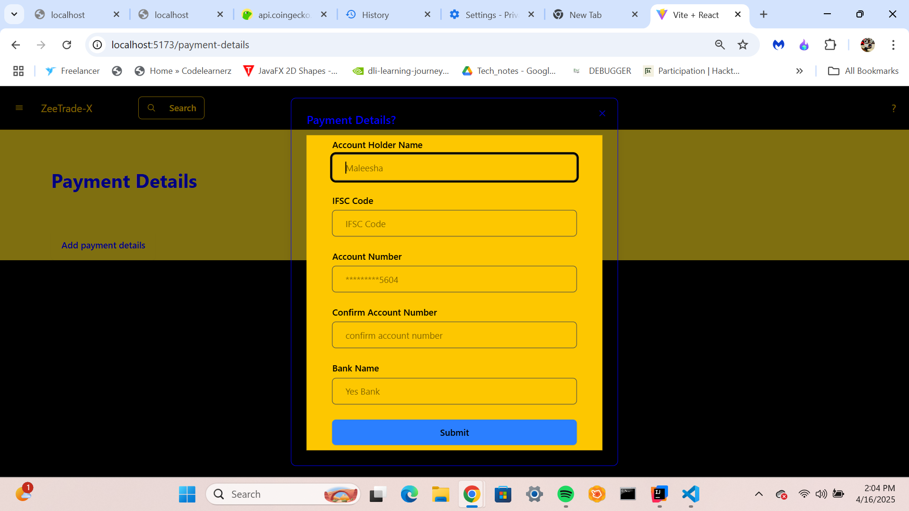

# Trading Platform - Spring Boot & React.js

## Project Description
This is a full-stack cryptocurrency trading platform built using **Spring Boot** for the backend and **React.js** with **Vite.js** for the frontend. The platform integrates with the **CoinGecko API** to fetch real-time cryptocurrency data, enabling users to view current prices, buy and sell assets, and manage their portfolios.

## ▶️ Project Demo (YouTube)

[](https://youtu.be/GpCEurOzY-s)
(https://youtu.be/GpCEurOzY-s)
## Key Features
- **Real-Time Cryptocurrency Data**: Fetch current prices and market trends using the **CoinGecko API**.
- **User Authentication**: Secure login and registration system for users.
- **Trading Dashboard**: View cryptocurrency prices, transaction history, and portfolio performance.
- **Buy/Sell Assets**: Users can buy and sell assets in real-time, with automatic price fetching.
- **Portfolio Management**: Users can track their portfolio balance and transaction history.
- **Profile Management**: Users can view and update their personal information.

## Screenshots

### Register Page


### Login Page


### ForgotPassword Page



### Home Page


### Trading Dashboard


### Example Coins stock chart Page


### Payment Details Page



## Setup Instructions

[](https://spring.io/projects/spring-framework)

[](https://spring.io/projects/spring-data-jpa)

[](https://hibernate.org/orm/)

[](https://maven.apache.org/)

[](https://www.mysql.com/downloads/)

[](https://www.postman.com/downloads/)


### Prerequisites
- Java 17 or above
- Node.js and npm
- Spring Boot
- React.js with Vite.js
- MySQL or any relational database
- CoinGecko API (No API key required, but usage limits apply)

### Backend Setup (Spring Boot)

## Installation
1. Clone the repository:
   ```bash
   git clone https://github.com/MaleeshaMAdhushanka/X-BackEnd.git


2. Configure MySQL database:
   ```properties
   spring.datasource.url=jdbc:mysql://localhost:3306/ZeeXmax
   spring.datasource.username=your_username
   spring.datasource.password=your_password
   
   
   ```bash
     mvn clean install
   ```

4. Run the application:
   ```bash
   mvn spring-boot:run
   ```

## Project Documentation


### Class Structure
The class diagram showing the system's architecture and relationships can be found here:
[View Class Diagram](./src/assets/zeexmax.png)

## API Documentation

Detailed API documentation is available through Postman:
[View API Documentation](https://documenter.getpostman.com/view/37889199/2sB2cbaeW5)

## Frontend Repository

The frontend repository for this project can be found here:
[Zee Tradex Frontend](https://github.com/MaleeshaMAdhushanka/ZeeTradex-ForntEnd.git)

   ```